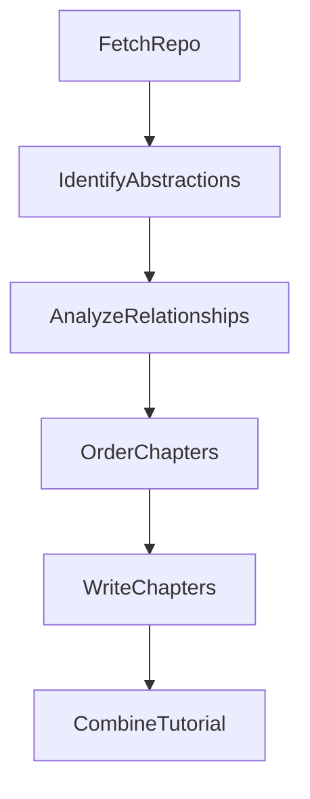

# PocketFlow-Tutorial-Codebase-Knowledge: High-Level Analysis

## Overview

**PocketFlow-Tutorial-Codebase-Knowledge** is an AI-powered tool that analyzes GitHub repositories or local codebases and automatically generates comprehensive, beginner-friendly tutorials. It transforms complex code into structured markdown documentation that explains core abstractions, their relationships, and how they work together.

**Repository**: https://github.com/The-Pocket/PocketFlow-Tutorial-Codebase-Knowledge

## Core Purpose

The tool addresses a common developer pain point: **understanding unfamiliar codebases**. Instead of manually digging through code, developers can:
- Input a GitHub URL or local directory path
- Optionally specify a target language for the tutorial
- Receive an auto-generated tutorial with:
  - Project summary
  - Visual relationship diagrams (Mermaid)
  - Detailed chapters explaining each core abstraction
  - Beginner-friendly analogies and explanations

## Architecture: The PocketFlow Framework

The project is built on **PocketFlow**, a minimalist (~100 lines) LLM framework that orchestrates multi-step AI workflows using a node-based pipeline pattern.

### Key Concepts

1. **Node**: A processing unit with three methods:
   - `prep(shared)`: Prepares data from shared store
   - `exec(prep_res)`: Executes core logic (can call LLMs)
   - `post(shared, prep_res, exec_res)`: Writes results back to shared store

2. **Flow**: Connects nodes in sequence using `>>` operator
   - Maintains a shared store (dictionary) for state across nodes
   - Handles retries and error recovery automatically

3. **BatchNode**: Special node type that processes items in parallel (map-reduce pattern)

## Six-Stage Workflow Pipeline

The tutorial generation follows this sequential workflow:



### 1. **FetchRepo** Node
- **Purpose**: Download or read the codebase
- **Input**: GitHub URL or local directory path, file patterns, filters
- **Process**:
  - Uses `crawl_github_files()` or `crawl_local_files()` utilities
  - Applies include/exclude patterns (e.g., only `.py`, `.js` files)
  - Filters by file size limits
  - Converts to relative paths for portability
- **Output**: List of `(path, content)` tuples stored in shared store

### 2. **IdentifyAbstractions** Node
- **Purpose**: Use LLM to identify 5-10 core code abstractions
- **Process**:
  - Creates indexed file context: `File Index 0: path/to/file.py`
  - Prompts LLM to identify key concepts/classes/modules
  - Requests YAML output with:
    - `name`: Abstraction name (translated if not English)
    - `description`: Beginner-friendly explanation
    - `files`: List of file *indices* (not paths) related to this abstraction
- **Output**: List of abstractions with metadata
  ```yaml
  - name: "Node"
    description: "A processing unit in the workflow..."
    files: [0, 3, 5]  # File indices
  ```

### 3. **AnalyzeRelationships** Node
- **Purpose**: Generate project summary and map abstraction interactions
- **Process**:
  - Provides LLM with:
    - Abstraction names/descriptions (with indices)
    - Code snippets from related files
  - Requests:
    - High-level project summary
    - Relationship list using indices: `from: 0, to: 1, label: "uses"`
- **Output**: 
  ```yaml
  summary: "PocketFlow is a minimalist framework..."
  details:
    - from: 0  # Node index
      to: 1    # Flow index
      label: "orchestrated by"
  ```

### 4. **OrderChapters** Node
- **Purpose**: Determine optimal teaching order
- **Process**:
  - LLM analyzes abstractions and relationships
  - Prioritizes:
    - Foundational/user-facing concepts first
    - Core entry points next
    - Implementation details last
- **Output**: Ordered list of abstraction indices
  ```yaml
  - 2  # Tutorial Flow (entry point)
  - 0  # Node (foundational)
  - 1  # BatchNode (specialized)
  ```

### 5. **WriteChapters** BatchNode (Map-Reduce)
- **Purpose**: Generate detailed chapter for each abstraction
- **Process** (for each abstraction in order):
  - **Context provided to LLM**:
    - Current abstraction details
    - Related file contents
    - Summaries of *previously written* chapters (for continuity)
  - **LLM generates**:
    - Beginner-friendly explanation
    - Code examples
    - Analogies and visualizations
  - **Parallel execution**: All chapters processed concurrently
- **Output**: List of chapter markdown content

### 6. **CombineTutorial** Node
- **Purpose**: Assemble final tutorial files
- **Process**:
  - Creates output directory: `{project_name}/`
  - Generates `index.md`:
    - Project summary
    - Mermaid relationship diagram
    - Links to chapter files
  - Writes individual chapter files: `01_node.md`, `02_flow.md`, etc.
- **Output**: Complete tutorial directory structure

## Key Technical Patterns

### Index-Based References
Instead of passing file paths/names everywhere, the system uses **numeric indices**:
- **Why**: Reduces LLM context size, simplifies validation, language-agnostic
- **How**: Files are indexed at fetch time, all later nodes reference `File Index 5` instead of full paths

### Retry and Fault Tolerance
Nodes support automatic retries with configurable parameters:
```python
identify_abstractions = IdentifyAbstractions(max_retries=5, wait=20)
```
- Built into PocketFlow framework
- Handles LLM API errors, rate limits, transient failures

### Multi-Language Support
The system supports generating tutorials in any language:
- Detects `language` parameter from shared store
- Prompts LLM to translate names, descriptions, summaries, and labels
- Preserves indices/structure (language-agnostic)

### Structured LLM Output
All LLM calls request YAML-formatted responses:
- **Validation**: Parse and validate structure after each LLM call
- **Error handling**: Retry on malformed output
- **Consistency**: Enforces schema compliance

### Shared State Store
A simple dictionary serves as the workflow's memory:
```python
shared = {
    "files": [...],
    "abstractions": [...],
    "relationships": {...},
    "chapter_order": [...],
    "chapters": [...]
}
```
Each node reads from and writes to this store.

## Dependencies and Utilities

### Core Dependencies
- **PocketFlow**: LLM workflow framework
- **LLM Integration**: Via `utils/call_llm.py`
  - Supports multiple providers: Gemini, Claude, OpenAI, Ollama, XAI
  - Configurable via environment variables
- **YAML parsing**: For structured LLM output

### Utility Functions
- `crawl_github_files()`: Fetches repo contents via GitHub API
- `crawl_local_files()`: Reads local directory with filtering
- `get_content_for_indices()`: Helper to retrieve file content by index
- `create_llm_context()`: Formats files for LLM consumption

## Example Output Structure

```
FastAPI/
├── index.md                    # Main entry point
│   ├── Project Summary
│   ├── Mermaid Diagram
│   └── Chapter Links
├── 01_starlette_application.md
├── 02_routing_system.md
├── 03_dependency_injection.md
└── ...
```

## Design Philosophy

1. **Workflow Pattern**: Sequential pipeline with clear stages
2. **Separation of Concerns**: Each node has a single responsibility
3. **LLM-as-Reasoning-Engine**: Let AI handle semantic analysis, not rule-based parsing
4. **Index-Based Indirection**: Minimize context size, maximize flexibility
5. **Beginner-First**: Output prioritizes clarity over technical accuracy

## Limitations and Considerations

- **LLM Dependency**: Quality depends on model capabilities (recommends Claude/GPT-4 level models)
- **Cost**: Multiple LLM calls per repo (fetch, identify, analyze, order, write×N)
- **Context Limits**: Large codebases may exceed token limits
- **Accuracy**: AI-generated explanations may contain inaccuracies
- **File Filtering**: Requires good include/exclude patterns to avoid noise

---

## Considerations for Go Port Using Restate

### Why Restate Framework?
Restate provides durable execution for distributed workflows, which would enhance this system with:
- **Durability**: Automatic state persistence across failures
- **Observability**: Built-in workflow tracking and debugging
- **Scalability**: Distributed execution for large codebases
- **Idempotency**: Safe retries without duplicate work

### Recommended Architecture for Go Port

**Restate Services** (instead of Nodes):
1. `FetchRepoService`: Durable file fetching with caching
2. `IdentifyAbstractionsService`: Stateful LLM analysis
3. `AnalyzeRelationshipsService`: Relationship extraction
4. `OrderChaptersService`: Chapter ordering logic
5. `WriteChapterService`: Individual chapter generation (parallel invocations)
6. `CombineTutorialService`: Final assembly

**Restate Workflow** (instead of Flow):
- Use Restate's workflow API to orchestrate service calls
- Leverage durable promises for parallel chapter generation
- Store intermediate results in Restate's state store

**Go Implementation Benefits**:
- Strong typing for validation (vs Python's dynamic typing)
- Better concurrency primitives for parallel chapter writing
- Native error handling (errors as values)
- Compiled binary with lower latency

**Key Challenges**:
- Port PocketFlow's node abstraction to Restate's service model
- Adapt LLM client libraries (Python → Go)
- Implement efficient file crawling in Go
- Handle YAML parsing and validation in Go's type system

**Simple vs Durable Trade-off**:
- PocketFlow: Ultra-simple, in-memory, single-process
- Restate: Distributed, durable, observable, but more complex

The Go+Restate port would be production-grade for:
- Large-scale batch processing
- Multi-tenant SaaS deployments
- Long-running workflows (hours/days)
- High-reliability requirements

For prototype/personal use, PocketFlow's simplicity may be preferable.
